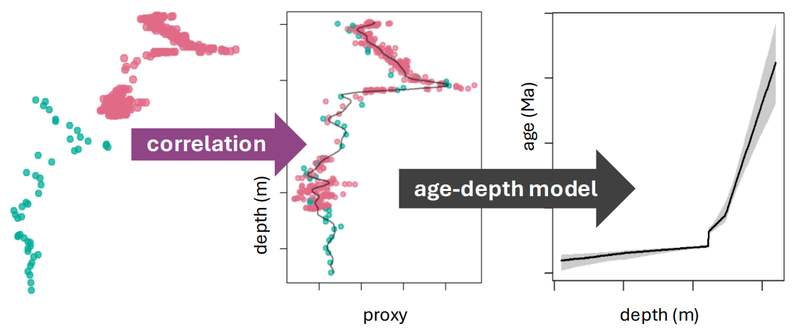

StratoBayes is peer-reviewed software developed at Durham University offering:

-   automated correlation of multiple sections or wells\
-   fully quantified uncertainty estimates and alternative correlations\
-   mathematical integration of stratigraphic data and prior knowledge
  

**Try StratoBayes now:**\
Sign up as a trial user to receive installation instructions via email through the form at  

[www.stratobayes.com](https://stratobayes.com/signup)
                  
**Having trouble with the installation? Watch our installation guide:**                
<iframe width="560" height="315" 
src="https://www.youtube.com/embed/hpRw3ORqfyc" 
title="YouTube video player" frameborder="0" 
allow="accelerometer; autoplay; clipboard-write; 
encrypted-media; gyroscope; picture-in-picture" 
allowfullscreen></iframe>  
